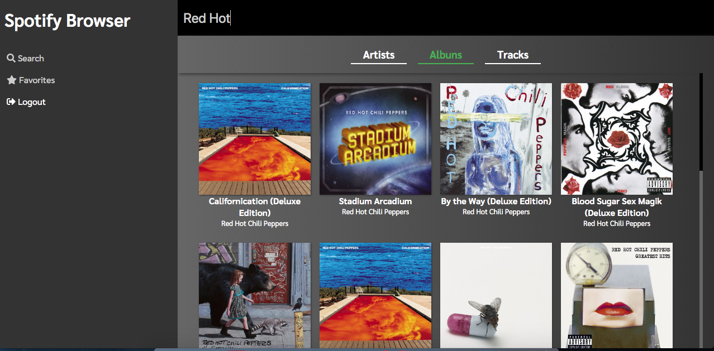

# Spotify Browser

Aplicação desenvolvida com uso da API do Spotify. Segunda versão do projeto pessoal [HiBeats](https://github.com/lucazweb/hibeats) 

#### Instalação
  - `npm install` ou `yarn install` na raiz do projeto
  - Executar `npm start` ou `yarn start`

#### Tecnologias utilizadas
- React / Redux / Redux Saga
- SASS / Flexbox / Styled-Components
